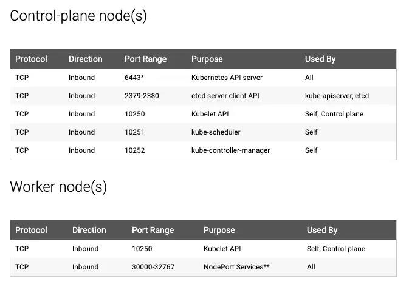
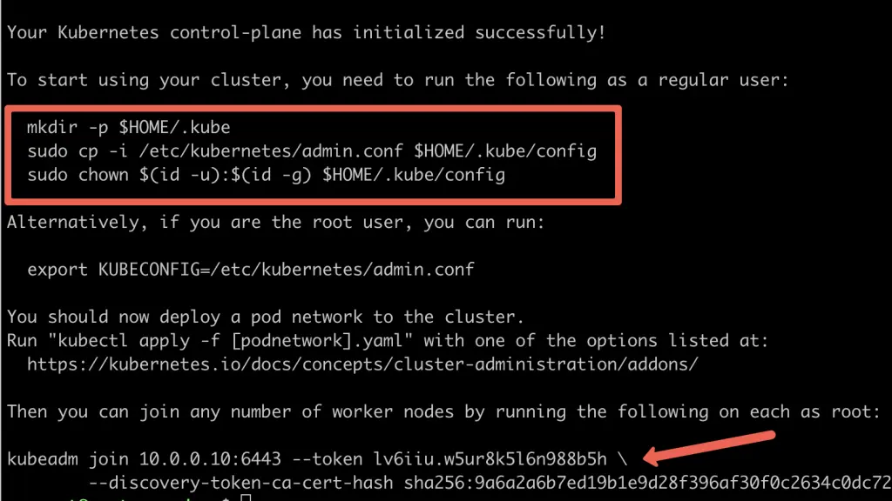
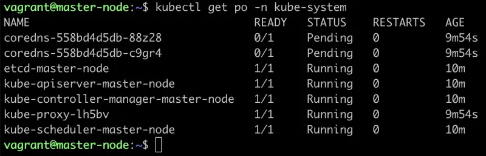
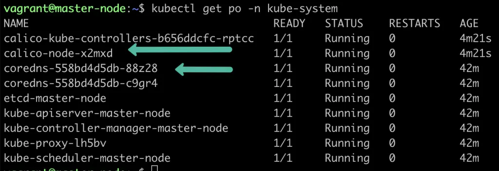
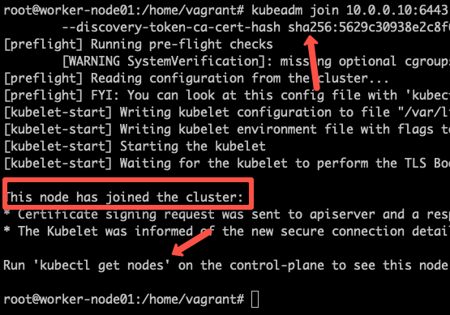

# Setup Kubernetes Cluster Using Kubeadm
## What is Kubeadm?

Kubeadm is a tool to set up a minimum viable Kubernetes cluster without much complex configuration. Also, Kubeadm makes the whole process easy by running a series of prechecks to ensure that the server has all the essential components and configs to run Kubernetes.

It is developed and maintained by the official Kubernetes community. There are other options like minikube, kind, etc., that are pretty easy to set up. You can check out my minikube tutorial. Those are good options with minimum hardware requirements if you are deploying and testing applications on Kubernetes.

But if you want to play around with the cluster components or test utilities that are part of cluster administration, Kubeadm is the best option. Also, you can create a production-like cluster locally on a workstation for development and testing purposes.

Following are the prerequisites for Kubeadm Kubernetes cluster setup.
1. Minimum two Ubuntu nodes [One master and one worker node]. You can have more worker nodes as per your requirement.
2. The master node should have a minimum of 2 vCPU and 2GB RAM.
3. For the worker nodes, a minimum of 1vCPU and 2 GB RAM is recommended.
4. 10.X.X.X/X network range with static IPs for master and worker nodes. We will be using the 192.x.x.x series as the pod network range that will be used by the Calico network plugin. Make sure the Node IP range and pod IP range don’t overlap.

## Kubeadm Port Requirements
Please refer to the following image and make sure all the ports are allowed for the control plane (master) and the worker nodes. If you are setting up the kubeadm cluster cloud servers, ensure you allow the ports in the firewall configuration.



## Kubernetes Cluster Setup Using Kubeadm

Following are the high-level steps involved in setting up a kubeadm-based Kubernetes cluster.
1. Install container runtime on all nodes- We will be using cri-o.
2. Install Kubeadm, Kubelet, and kubectl on all the nodes.
3. Initiate Kubeadm control plane configuration on the master node.
4. Save the node join command with the token.
5. Install the Calico network plugin.
6. Join the worker node to the master node (control plane) using the join command.
7. Validate all cluster components and nodes.

All the steps given in this guide are referred from the official Kubernetes documentation and related GitHub project pages.

Now let’s get started with the setup.

## Enable iptables Bridged Traffic on all the Nodes
Execute the following commands on all the nodes for IPtables to see bridged traffic.
```shell
cat <<EOF | sudo tee /etc/modules-load.d/k8s.conf
overlay
br_netfilter
EOF

sudo modprobe overlay
sudo modprobe br_netfilter

# sysctl params required by setup, params persist across reboots
cat <<EOF | sudo tee /etc/sysctl.d/k8s.conf
net.bridge.bridge-nf-call-iptables  = 1
net.bridge.bridge-nf-call-ip6tables = 1
net.ipv4.ip_forward                 = 1
EOF

# Apply sysctl params without reboot
sudo sysctl --system
```
## Disable swap on all the Nodes
For kubeadm to work properly, you need to disable swap on all the nodes using the following command.
```shell
sudo swapoff -a
(crontab -l 2>/dev/null; echo "@reboot /sbin/swapoff -a") | crontab - || true
```
The fstab entry will make sure the swap is off on system reboots.
## Install CRI-O Runtime On All The Nodes
The basic requirement for a Kubernetes cluster is a container runtime. You can have any one of the following container runtimes.
1. CRI-O
2. containerd
3. Docker Engine (using cri-dockerd)

We will be using CRI-O instead of Docker for this setup as Kubernetes deprecated Docker engine

As a first step, we need to install cri-o on all the nodes. Execute the following commands on all the nodes.

Create the .conf file to load the modules at bootup
```shell
cat <<EOF | sudo tee /etc/modules-load.d/crio.conf
overlay
br_netfilter
EOF

# Set up required sysctl params, these persist across reboots.
cat <<EOF | sudo tee /etc/sysctl.d/99-kubernetes-cri.conf
net.bridge.bridge-nf-call-iptables  = 1
net.ipv4.ip_forward                 = 1
net.bridge.bridge-nf-call-ip6tables = 1
EOF
```
Execute the following commands to enable overlayFS & VxLan pod communication.
```shell
sudo modprobe overlay
sudo modprobe br_netfilter
```
Set up required sysctl params, these persist across reboots.
```shell
cat <<EOF | sudo tee /etc/sysctl.d/99-kubernetes-cri.conf
net.bridge.bridge-nf-call-iptables  = 1
net.ipv4.ip_forward                 = 1
net.bridge.bridge-nf-call-ip6tables = 1
EOF
```
Reload the parameters.
```shell
sudo sysctl --system
```
Enable cri-o repositories for version 1.23
```shell
OS="xUbuntu_20.04"

VERSION="1.23"

cat <<EOF | sudo tee /etc/apt/sources.list.d/devel:kubic:libcontainers:stable.list
deb https://download.opensuse.org/repositories/devel:/kubic:/libcontainers:/stable/$OS/ /
EOF
cat <<EOF | sudo tee /etc/apt/sources.list.d/devel:kubic:libcontainers:stable:cri-o:$VERSION.list
deb http://download.opensuse.org/repositories/devel:/kubic:/libcontainers:/stable:/cri-o:/$VERSION/$OS/ /
EOF
```
Add the gpg keys.
```shell
curl -L https://download.opensuse.org/repositories/devel:kubic:libcontainers:stable:cri-o:$VERSION/$OS/Release.key | sudo apt-key --keyring /etc/apt/trusted.gpg.d/libcontainers.gpg add -
curl -L https://download.opensuse.org/repositories/devel:/kubic:/libcontainers:/stable/$OS/Release.key | sudo apt-key --keyring /etc/apt/trusted.gpg.d/libcontainers.gpg add -
```
Update and install crio and crio-tools.
```shell
sudo apt-get update
sudo apt-get install cri-o cri-o-runc cri-tools -y
```
Reload the systemd configurations and enable cri-o.
```shell
sudo systemctl daemon-reload
sudo systemctl enable crio --now
```
The cri-tools contain crictl, a CLI utility to interact with the containers created by the contianer runtime. When you use container runtimes other than Docker, you can use the crictl utility to debug containers on the nodes. 
## Install Kubeadm & Kubelet & Kubectl on all Nodes
Install the required dependencies.
```shell
sudo apt-get update
sudo apt-get install -y apt-transport-https ca-certificates curl
sudo curl -fsSLo /usr/share/keyrings/kubernetes-archive-keyring.gpg https://packages.cloud.google.com/apt/doc/apt-key.gpg
```
Add the GPG key and apt repository.
```shell
echo "deb [signed-by=/usr/share/keyrings/kubernetes-archive-keyring.gpg] https://apt.kubernetes.io/ kubernetes-xenial main" | sudo tee /etc/apt/sources.list.d/kubernetes.list
```
Update apt and install the latest version of kubelet, kubeadm, and kubectl.
```shell
sudo apt-get update -y
sudo apt-get install -y kubelet kubeadm kubectl
```
You can use the following commands to find the latest versions.
```shell
sudo apt update
apt-cache madison kubeadm | tac
```
Specify the version as shown below.
```sh
sudo apt-get install -y kubelet=1.26.1-00 kubectl=1.26.1-00 kubeadm=1.26.1-00
```
Add hold to the packages to prevent upgrades.
```shell
sudo apt-mark hold kubelet kubeadm kubectl
```
Now we have all the required utilities and tools for configuring Kubernetes components using kubeadm.

Add the node IP to KUBELET_EXTRA_ARGS.
```shell
sudo apt-get install -y jq
local_ip="$(ip --json a s | jq -r '.[] | if .ifname == "eth1" then .addr_info[] | if .family == "inet" then .local else empty end else empty end')"
cat > /etc/default/kubelet << EOF
KUBELET_EXTRA_ARGS=--node-ip=$local_ip
EOF
```
## Initialize Kubeadm On Master Node To Setup Control Plane
Execute the commands in this section only on the master node.

First, set the following environment variables. Replace 10.0.0.10 with the IP of your master node.
```shell
IPADDR="10.0.0.10"
NODENAME=$(hostname -s)
POD_CIDR="192.168.0.0/16"
```
Now, initialize the master node control plane configurations using the following kubeadm command.
```shell
sudo kubeadm init --apiserver-advertise-address=$IPADDR  --apiserver-cert-extra-sans=$IPADDR  --pod-network-cidr=$POD_CIDR --node-name $NODENAME --ignore-preflight-errors Swap
```
--ignore-preflight-errors Swap is actually not required as we disabled the swap initially.

On a successful kubeadm initialization, you should get an output with kubeconfig file location and the join command with the token as shown below. Copy that and save it to the file. we will need it for joining the worker node to the master



Use the following commands from the output to create the kubeconfig in master so that you can use kubectl to interact with cluster API.
```shell
mkdir -p $HOME/.kube
sudo cp -i /etc/kubernetes/admin.conf $HOME/.kube/config
sudo chown $(id -u):$(id -g) $HOME/.kube/config
```
Now, verify the kubeconfig by executing the following kubectl command to list all the pods in the kube-system namespace.
```shell
kubectl get po -n kube-system
```
You should see the following output. You will see the two Coredns pods in a pending state. It is the expected behavior. Once we install the network plugin, it will be in a running state



```shell
Note: You can copy the admin.conf file from the master to your workstation in $HOME/.kube/config location if you want to execute kubectl commands from the workstation.
```
You verify all the cluster component health statuses using the following command.
```shell
kubectl get --raw='/readyz?verbose'
```
You can get the cluster info using the following command.
```shell
kubectl cluster-info 
```
By default, apps won’t get scheduled on the master node. If you want to use the master node for scheduling apps, taint the master node.
```shell
kubectl taint nodes --all node-role.kubernetes.io/master-
```
## Install Calico Network Plugin for Pod Networking
Kubeadm does not configure any network plugin. You need to install a network plugin of your choice.

I am using the Calico network plugin for this setup.

Execute the following command to install the calico network plugin on the cluster.
```shell
kubectl apply -f https://raw.githubusercontent.com/projectcalico/calico/v3.25.0/manifests/calico.yaml
```
After a couple of minutes, if you check the pods in kube-system namespace, you will see calico pods and running CoreDNS pods.



## Join Worker Nodes To Kubernetes Master Node
We have set up cri-o, kubelet, and kubeadm utilities on the worker nodes as well.

Now, let’s join the worker node to the master node using the Kubeadm join command you have got in the output while setting up the master node.

If you missed copying the join command, execute the following command in the master node to recreate the token with the join command.
```shell
kubeadm token create --print-join-command
```
Here is what the command looks like. Use sudo if you running as a normal user. This command performs the TLS bootstrapping for the nodes.
```shell
sudo kubeadm join 10.128.0.37:6443 --token j4eice.33vgvgyf5cxw4u8i \
    --discovery-token-ca-cert-hash sha256:37f94469b58bcc8f26a4aa44441fb17196a585b37288f85e22475b00c36f1c61
```
On successful execution, you will see the output saying, “This node has joined the cluster”.



Now execute the kubectl command from the master node to check if the node is added to the master.
```shell
kubectl get nodes
```
Example output,
```shell
root@master-node:/home/vagrant# kubectl get nodes
NAME            STATUS   ROLES           AGE     VERSION
master-node     Ready    control-plane   14m     v1.24.6
worker-node01   Ready    <none>          2m13s   v1.24.6
worker-node02   Ready    <none>          2m5s    v1.24.6
```
In the above command, the ROLE is <none> for the worker nodes. You can add a label to the worker node using the following command. Replace worker-node01 with the hostname of the worker node you want to label.
```shell
kubectl label node worker-node01  node-role.kubernetes.io/worker=worker
```
You can further add more nodes with the same join command.

